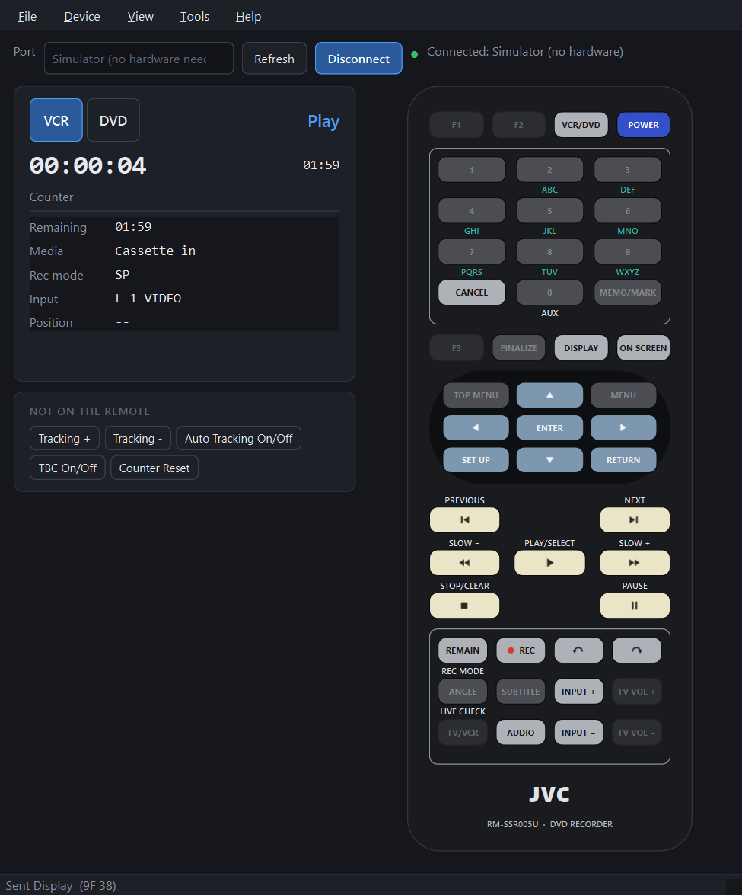
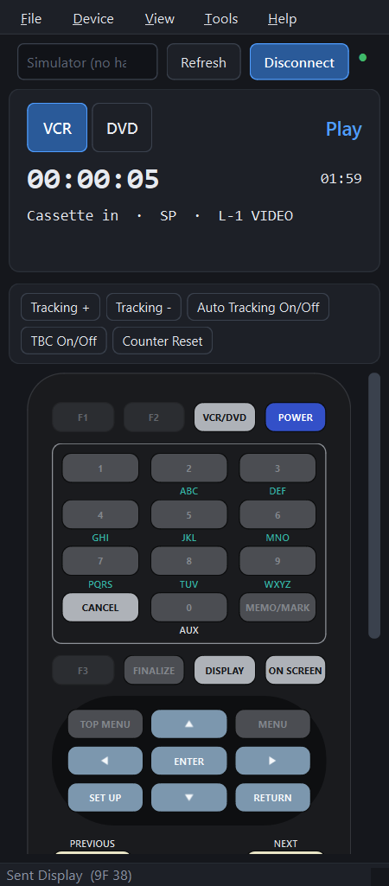

# JVC SR-MV55 Control

A desktop app for controlling a **JVC SR-MV55U** DVD/VCR deck from a computer
over its RS-232C serial port — a virtual remote with live status, recording
control, macros, and a raw protocol console.

Built from the protocol documented in the SR-MV45U/SR-MV55U user manual,
pages 73–85. Not affiliated with JVC.

> **Only the SR-MV55U has the serial port.** The SR-MV45U shares the same
> manual but has no *Serial Command* connector, so this program cannot control
> it.

---

## Features

One screen: live status beside a copy of the remote that came with the deck.

<p>
  
  
</p>

- **Handset** — the RM-SSR005U remote, same keys in the same places and
  colours, sending the codes the real remote sends. Keys the selected deck
  can't use grey out, arrows repeat while held, and the keyboard works too
  (arrows, Enter, Backspace for Return, 0–9). REC and FINALIZE ask first
- **Live status** — decodes the deck's Status Sense continuously: transport
  mode, counter, remaining time, media type, record mode, input, tape sensors,
  disc type, dubbing state
- **Extra keys** — the VCR keys the remote doesn't have (tracking, auto
  tracking, TBC, counter reset) under the status card; configurable from any
  of the ~90 wired-remote codes
- **Macros** (Tools menu) — named command sequences with delays, saved as
  shareable JSON, with a starter set aimed at VHS→DVD transfers
- **Console** (Tools menu) — raw hex sender and a colour-coded traffic log with
  decoded meanings, so you can see exactly what's on the wire
- **Diagnostics** (Device menu) — a scripted probe that works out why a command
  isn't doing anything, with controls either side and deck-state checks
- **Simulator** — a built-in fake deck, so you can explore the whole app with
  no hardware connected
- **Dark and light themes**

---

## Hardware setup

### Cable

Connect the deck's **Serial Command** port (DB9) to a USB-to-serial adapter.

| DB9 pin | Signal | Direction |
|---|---|---|
| 2 | TxD | deck → PC |
| 3 | RxD | PC → deck |
| 5 | GND | — |

No handshaking lines are used.

**Straight-through or null-modem? It depends on your cable, not on the deck.**

The deck is wired as DCE, so in principle a **straight-through** cable is
correct, and that is what the manual specifies. In practice, many inexpensive
USB-to-serial cables have **pins 2 and 3 reversed internally** whatever they are
sold as; with one of those you need a **null-modem adapter** (male-to-female,
which crosses 2 and 3) to cancel the reversal out. Both situations are common.

> **A loopback test cannot tell the two apart.** Bridging pins 2 and 3 at the
> connector only proves TX and RX reach each other, which succeeds with a
> reversed cable too. Try straight through first; if the deck never answers,
> add a null-modem adapter before assuming anything is broken.

### Port settings

The app configures these for you:

| Setting | Value |
|---|---|
| Baud rate | 9600 |
| Data bits | 8 |
| Parity | **Odd** |
| Stop bits | 1 |
| Flow control | None |

Odd parity is unusual, and it's the most common reason a quick test in a
generic terminal program appears to fail.

### Multi-byte commands need a gap between their bytes

**This is not in the manual, and it is the single most important thing to know
if you are writing your own software for this deck.**

An SR-MV55U will silently ignore a multi-byte command whose bytes arrive
back-to-back at 9600 baud. Sending `F0 30` (Command Target) as one write draws
no response at all — not even a NAK. Send the same two bytes as separate writes
a few tens of milliseconds apart and both are acknowledged.

Single-byte commands are unaffected, which makes this deeply confusing to
diagnose: Play, Stop, Rewind and Eject all work perfectly while *every*
multi-byte command fails silently — deck targeting, input and record-mode
selection, title and chapter search, shuttle speeds, and all of Remote Data.
It reads as "some buttons don't do anything" rather than as a timing problem.

This app sends every byte of a multi-byte command as its own write, spaced by
60 ms by default (**File → Settings → Gap between bytes**). Set it to 0 if you
have a deck that doesn't need it.

Confirmed on real hardware via **Device → Diagnose Remote Data…**, which sends
the identical command both ways and reports the difference.

### Before it will respond

- Wait about **10 seconds** after powering the deck on. The manual states
  communication isn't established before then.
- Make sure **Mode Lock is off**. If the front panel shows `LOCKED`, some
  RS-232C commands are blocked. Mode Lock survives an AC power cycle, so it has
  to be cancelled on the unit itself.
- Install your adapter's driver. CH340, CP2102 and FTDI chipsets each need
  their own on some Windows versions.

---

## Installing

### Windows, prebuilt

Download `JVC-SR-MV55-Control.exe` and run it. No installation, no Python.

Because the executable isn't code-signed, Windows will show **"Windows
protected your PC"** the first time. Click **More info → Run anyway**. If you'd
rather not, run from source instead — the instructions are below.

### From source (Windows, macOS, Linux)

```bash
pip install -e .
```

Then launch it:

```bash
jvc-sr-mv55
```

Or without installing:

```bash
python run.py
```

Requires Python 3.10 or newer.

---

## Using it

1. Pick your serial port in the top bar and press **Connect**. If you don't
   have the cable yet, choose **Simulator** to explore everything offline.
2. Choose **VCR** or **DVD** in the status card (or press the handset's
   **VCR/DVD** key). Every command is deck-scoped, and keys the selected deck
   can't use are greyed out.
3. Use the handset as you would the real remote. The keyboard works too:

| Key | Action |
|---|---|
| `Space` | Play |
| `K` | Still |
| `S` | Stop |
| `J` / `L` | Rewind / fast forward |
| `,` / `.` | Frame step back / forward |
| Arrows, `Enter`, `Backspace` | Handset arrows, Enter, Return |
| `0`–`9` | Handset number keys |

**View → Configure extra keys…** picks which keys sit under the status card.

Make the window narrow to dock it beside a capture window. Below about 720 px
it becomes a single column: a one-line status card and the extra keys stay
pinned at the top, and the handset scrolls underneath. It goes down to 360 px
wide.

### Recording

Set the input with **INPUT +/−** and the mode with **REMAIN / REC MODE**, then
press **REC** on the handset and confirm. The remote's REC key records straight
away — unlike the serial Record command, it doesn't need a Rec Request first.

### When something doesn't work

Open **Tools → Console** and send `D7`. A healthy deck answers with five status
bytes — note there is no `D7` in the reply; sense replies carry no opcode. If
nothing comes back, the problem is the cable, the port settings, the warm-up
time, or Mode Lock — in roughly that order of likelihood.

`Device → Probe protocol` runs that check for you and explains the result.
`Device → Diagnose Remote Data…` goes further: it runs a scripted set of probes
with known-good controls either side and tells you what the results rule out.

If the deck stops accepting commands, it has probably latched its **Error**
state (response `02`). The status panel shows a red banner with a Clear button
when this happens.

---

## Using the protocol from your own code

The lower layers have no GUI dependency, so you can script the deck directly:

```python
from jvcvcr import protocol as P
from jvcvcr.device import DeviceController
from jvcvcr.protocol import Deck
from jvcvcr.transport import SerialTransport

deck = DeviceController()
deck.connect(SerialTransport("COM3"))

deck.set_deck(Deck.DVD)
deck.send(P.set_rec_mode("FR120"))
deck.send(P.title_search(3))
deck.send_command("play")

print(deck.state.status.transport)   # e.g. "Play"
print(deck.state.counter)            # e.g. "00:12:34"
```

`jvcvcr.protocol` is pure functions and tables with no dependencies at all, if
you only want to build and parse bytes yourself.

---

## Building the executable

```bash
pip install -e ".[build]"
pyinstaller jvc-sr-mv55.spec
```

The result lands in `dist/`.

## Running the tests

```bash
pip install -e ".[dev]"
pytest
```

The suite checks every encoder and decoder against the worked examples printed
in the manual, and runs the full device layer against the simulator. No
hardware needed.

---

## Project layout

```
jvcvcr/
  protocol.py    commands, tables, encoders, decoders — pure, no I/O
  transport.py   serial port and simulator byte pipes
  device.py      threaded controller: pacing, framing, polling, state
  simulator.py   a fake SR-MV55U that speaks the real protocol
  macros.py      shareable command sequences
  gui/           PySide6 interface
```

**If you are writing your own software for this deck, read
[PROTOCOL.md](PROTOCOL.md) first.** It documents three behaviours that are not
in the manual and that will otherwise cost you a great deal of time: multi-byte
commands need a gap between their bytes, sense replies do not echo their
opcode, and the VCR returns partial timecodes.

See [PLAN.md](PLAN.md) for design reasoning and [ROADMAP.md](ROADMAP.md) for
what's planned next.

## Licence

MIT. See [LICENSE](LICENSE).
